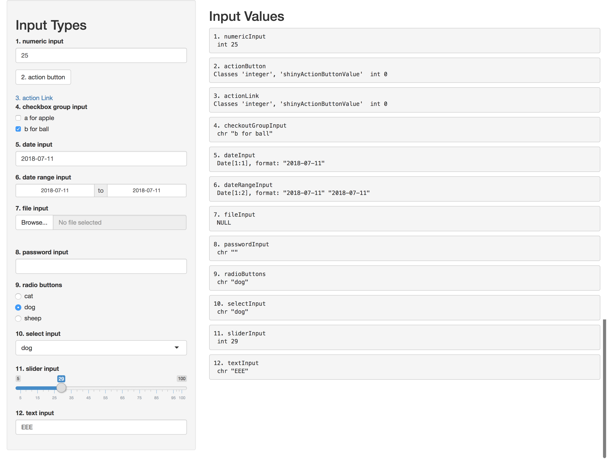
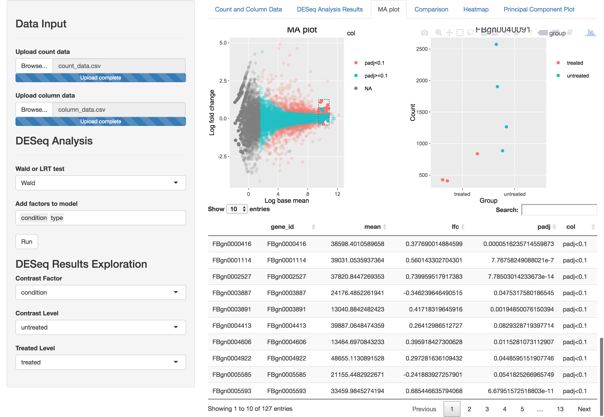

# RShinyApps

## Input Components app

I created this shiny app mainly for showing how to use different kinds of shiny input components. Input
components are bricks for building user-interfaces. On the left it is a list of input types. 
The right side shows the input variable names, object types and what values the app take from user inputs.

 

## DESeq2 app

This app is for differential expression analysis and visualization.

